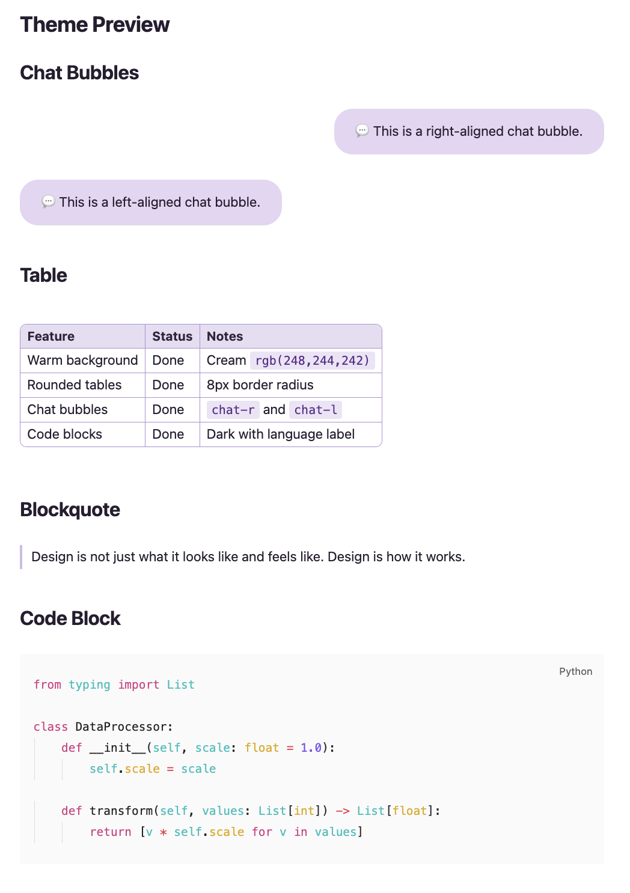
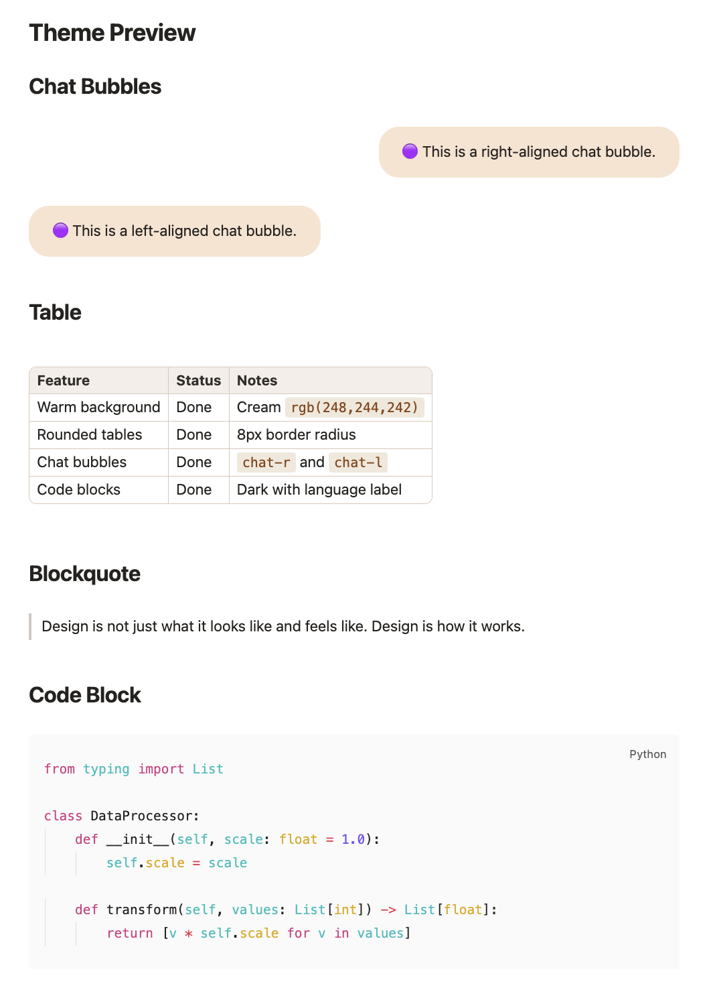
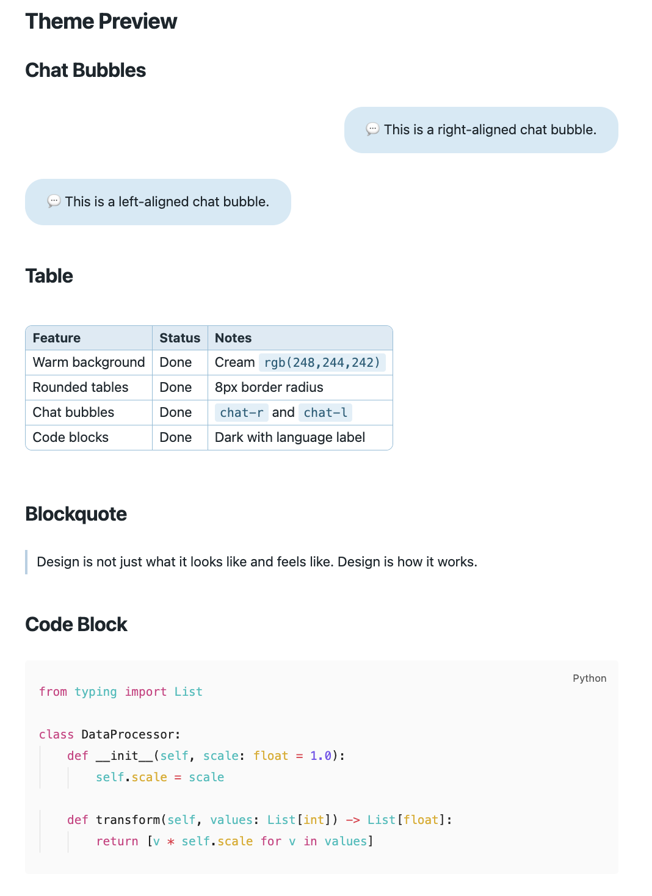
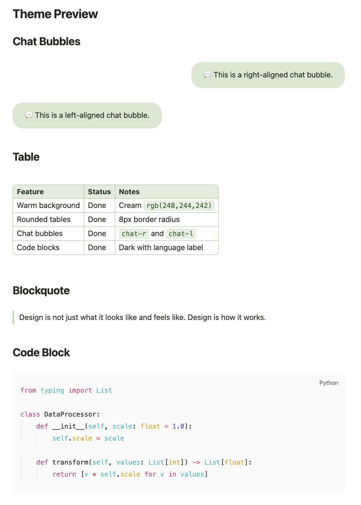
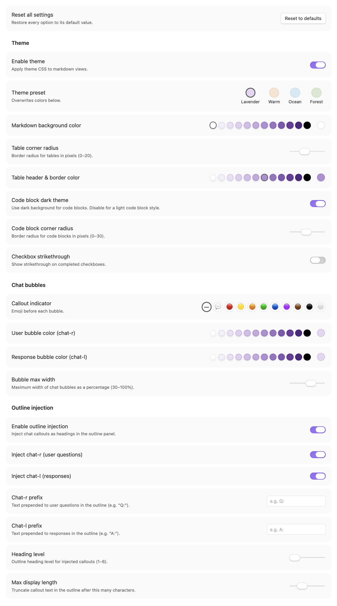

# Chat Bubble Theme Plugin

An Obsidian theme plugin with 4 color presets (Lavender, Warm, Ocean, Forest), chat bubble callouts with optional emoji indicators, rounded tables, and full color customization — bundled as a plugin.

## Why a plugin instead of a pure theme?

Obsidian themes are CSS-only and cannot execute JavaScript. This plugin adds one feature that requires JS:

- **Chat callout outline injection** — parses `> [!chat-r]` and `> [!chat-l]` callouts and injects them as virtual headings into Obsidian's metadata cache, so they appear in the Outline pane (including Quiet Outline).

All theme styling is dynamically generated from plugin settings, giving full control over colors, sizes, and features without editing CSS.

## Preview

| Lavender | Warm | Ocean | Forest |
|:---:|:---:|:---:|:---:|
|  |  |  |  |

## Features

- **4 theme presets** — Lavender (lilac/purple), Warm (cream/brown), Ocean (ice/teal), Forest (mint/green)
- Per-theme color palettes with white/black endpoints for fine-tuning
- Callout emoji indicators (colored circles, 💬, or none)
- Rounded tables with configurable corner radius and header/border color
- Code blocks with dark/light theme toggle, language label, and always-visible copy button
- Chat bubble callouts (`chat-r` for right-aligned, `chat-l` for left-aligned)
- Styled inline code, blockquotes, links, and lists
- Chat callouts visible in Outline / Quiet Outline as configurable heading entries

## Settings

Accessible from **Settings > Community plugins > Chat Bubble Theme Plugin** (gear icon).



| Group | Options |
|-------|---------|
| **Reset** | Reset all settings to defaults with one click |
| **Theme** | Theme preset (Lavender / Warm / Ocean / Forest), enable/disable theme, markdown background color, table corner radius, table header & border color, code block dark/light theme, code block corner radius, checkbox strikethrough |
| **Chat Bubbles** | Callout indicator (none / 💬 / colored circle emojis), user (chat-r) and response (chat-l) bubble colors, max bubble width |
| **Outline Injection** | Enable/disable injection, per-callout toggle, heading prefix (e.g. "Q:" / "A:"), heading level, max display length |

Color settings include a **preset palette** of theme-matched swatches (with white/black endpoints) alongside the standard color picker for quick selection.

## Installation

1. Copy the `chat-bubble-theme` folder into `.obsidian/plugins/`
2. Enable the plugin in **Settings > Community plugins**
3. Set **Settings > Appearance > CSS Theme** to none (the plugin provides all styling)

## Chat Bubble Callouts

Use `[!chat-r]` and `[!chat-l]` for right- and left-aligned chat bubbles:

```markdown
> [!chat-r]
> This appears as a right-aligned bubble.

> [!chat-l]
> This appears as a left-aligned bubble.
```

## Theme Presets

| Theme    | Bubbles           | Link accent        |
|----------|-------------------|--------------------|
| Lavender | `#E4D6F2` violet  | `#6A3D9A` purple   |
| Warm     | `#F9E3D0` peach   | `#A0522D` brown    |
| Ocean    | `#D4EAF5` sky     | `#2B6E8A` teal     |
| Forest   | `#D8E8D0` sage    | `#3D6B2E` green    |

Switching presets overwrites color settings with theme defaults. You can then fine-tune any color individually.

## License

MIT
